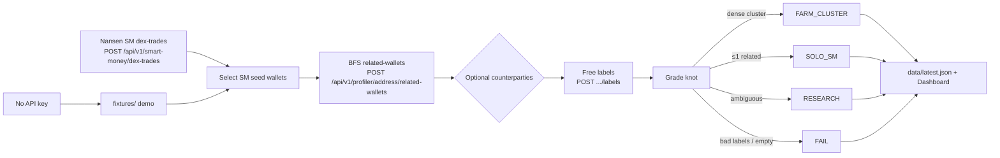

# Glass Knot

**Meridian Buildathon entry** — Solana Smart Money **knot inspector**.

> **PAPER · INSPECT ONLY · NO COPY-TRADE · NO ORDERS · NO SIZE**

Glass Knot never copy-trades, never places orders, and never recommends size.
It grades wallet knots only: **`FARM_CLUSTER` | `SOLO_SM` | `RESEARCH` | `FAIL`**.

## One-liner (submission)

**Glass Knot** polls Nansen Solana Smart Money DEX trades, BFS-expands each SM seed via profiler **related-wallets** (optional counterparties), attaches free labels, and grades the resulting knot as a farm cluster, solo SM, research queue, or fail — inspect-only, no execution.

## Meridian checklist

| Item | Detail |
|------|--------|
| Deadline | **27 Sep 2026 23:59 UTC** |
| API budget | **1 000** Nansen calls (tracked in `data/api_calls.json`) |
| Submit | Meridian Typeform (buildathon form) |
| Demo video | **Silent** screen capture of the dashboard (tape + knot expansion + grades) |
| Policy | Paper / inspect only — no copy-trade, orders, or size |

Pace remaining calls with `python scripts/burn_calls.py --budget N` (live key required).

## Why this wins

Most SM tools rush to copy-trade. Glass Knot does the opposite:

- Treats related-wallet **structure** as the signal (farm vs solo)
- BFS knot expansion is the product surface
- Grades are governance-shaped: farm / solo / research / fail
- Volume never promotes; size is never suggested

## Quick start

```bash
cd /workspace/glass-meridian
python3 -m venv .venv
source .venv/bin/activate
pip install -r requirements.txt
cp .env.example .env   # optional: set NANSEN_API_KEY

# Demo mode works with no key (fixtures/)
python scripts/poll_once.py

# Dashboard
uvicorn app.main:app --host 0.0.0.0 --port 8765
# → http://127.0.0.1:8765
```

With `NANSEN_API_KEY` set, polls hit live Nansen and every request increments `data/api_calls.json`.
The UI refreshes every 15s and on **Poll now**.

## Architecture



## Pipeline

1. **Poll** `POST https://api.nansen.ai/api/v1/smart-money/dex-trades`  
   Body: `chains: ["solana"]`, `filters.trade_value_usd.min`, `order_by: block_timestamp DESC`.
2. **Seed** distinct SM `trader_address` values from the tape.
3. **BFS** `POST /api/v1/profiler/address/related-wallets` (`address`, `chain: "solana"`, pagination) up to configured depth / wallet cap.
4. **Optional** `POST /api/v1/profiler/address/counterparties` (`group_by: wallet`) when `INCLUDE_COUNTERPARTIES=1`.
5. **Labels** free `POST /api/v1/profiler/address/labels` by default (avoid `premium_labels` unless `USE_PREMIUM_LABELS=1`).
6. **Grade**
   - **FARM_CLUSTER** — dense related set (≥ `FARM_MIN_RELATED`, default 4) or multi-hop dense graph
   - **SOLO_SM** — ≤ `SOLO_MAX_RELATED` related wallets (default 1)
   - **RESEARCH** — in between / ambiguous
   - **FAIL** — scam/risk labels or missing seed
7. **Dashboard** — sticky policy banner, live tape, knot expansion, grade chips, **api_calls** counter.

## Auth & call counter

| Env | Header | Behavior |
|-----|--------|----------|
| `NANSEN_API_KEY` | `apikey` | Live poll; every HTTP request increments `data/api_calls.json` |
| missing / empty | — | Demo mode + `fixtures/` (counter unchanged) |

```bash
# Report progress toward 1k
python scripts/burn_calls.py

# Pace N more live calls (sleep between requests)
python scripts/burn_calls.py --budget 50 --sleep 1.5
```

## Project layout

```
glass-meridian/          # folder kept; product branding = Glass Knot
  app/
    main.py              # FastAPI + background poll
    config.py
    nansen.py            # API client (live → api_calls++)
    api_counter.py
    pipeline.py          # SM → BFS → grade → latest.json
    grader.py
  static/                # sticky banner, tape, knot expansion, grade chips
  fixtures/              # FARM_CLUSTER + SOLO_SM (+ RESEARCH/FAIL) demo
  data/latest.json       # generated
  data/api_calls.json    # live request counter (target 1000)
  scripts/poll_once.py
  scripts/burn_calls.py
  requirements.txt
  .env.example
```

## API (local)

| Method | Path | Notes |
|--------|------|--------|
| GET | `/` | Dashboard |
| GET | `/api/health` | demo flag + policy + grades + api_calls |
| GET | `/api/latest` | full payload |
| GET | `/api/calls` | `data/api_calls.json` |
| POST | `/api/poll` | force one pipeline run |

## Demo fixtures (no key)

| Seed role | Expected grade |
|-----------|----------------|
| Farm seed with 6 related (+ multi-hop) | **FARM_CLUSTER** |
| Solo SM with 0 related | **SOLO_SM** |
| Fund with 2 related | **RESEARCH** |
| Scam-labeled wallet | **FAIL** |

## Anti-copytrade policy (product law)

- Grades only: `FARM_CLUSTER` | `SOLO_SM` | `RESEARCH` | `FAIL`
- Forbidden: copy-trade, place order, size recommendation, `KEEP_TRADE`
- UI banner + README + payload `policy` all state the same rule
- Notes always include `volume_is_not_edge` and `no_copy_trade`

## Nansen field notes (verified)

- Base: `https://api.nansen.ai`
- Header: `apikey`
- SM dex-trades: `chains:["solana"]`, `filters.trade_value_usd.min`, order `block_timestamp`
- Related wallets / counterparties / labels: `address` + `chain:"solana"` (+ pagination / date / `group_by: wallet` as documented)
- Prefer free **labels**; avoid **premium_labels** unless explicitly enabled

## License / buildathon

Built for the Meridian Buildathon. Inspect-only by design. Deadline **27 Sep 2026 23:59 UTC**.
