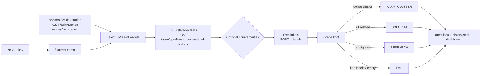

# Glass Knot

Solana Smart Money **knot inspector**.

> **PAPER · INSPECT ONLY · NO COPY-TRADE · NO ORDERS · NO SIZE**

When a Smart Money wallet touches a Solana token, is the buyer a **solo SM** or a **farm cluster** of related wallets? Glass Knot answers that from related-wallet structure. It never copy-trades, never places orders, and never recommends size.

Grades: `FARM_CLUSTER` | `SOLO_SM` | `RESEARCH` | `FAIL`.

Public repo: https://github.com/talentsolutionsmyanmar-max/glass-knot

## Problem

Smart Money tape shows *that* a labeled wallet bought a mint. It does not show *who else is wired to that wallet*. A lone SM buyer and a funded farm can look the same on a trade list.

Glass Knot:

1. Polls Nansen Solana SM DEX trades.
2. BFS-expands each seed through profiler **related-wallets**.
3. Attaches free labels (optional counterparties).
4. Grades the knot as farm, solo, research, or fail — inspect only.

Volume is not edge. Size is never suggested.

## 30s demo path

No API key required (uses `fixtures/`).

```bash
python scripts/poll_once.py
uvicorn app.main:app --host 0.0.0.0 --port 8765
# open http://127.0.0.1:8765
```

Then, silently:

1. **Policy strip** — paper / inspect only.
2. **Mother-test banner** — “Is this Smart Money touch a farm or solo?”
3. **Featured knot** — token, short seed, grade badge, plain-English reason, confidence, nodes/edges.
4. **BFS graph** — farm is a clustered hull; click the `SOLO_SM` row and the graph goes sparse with the seed highlighted.
5. **Why this grade** — related count, shared-mint density, labels, timing.
6. **Recent grades** — last inspect results (no PnL). Tape stays secondary.

Demo fixtures include one of each grade (farm with a multi-hop cluster, solo with zero related, research in between, fail with scam labels).

To serve a frozen `data/latest.json` without polling Nansen:

```bash
FREEZE_DASHBOARD=1 uvicorn app.main:app --host 0.0.0.0 --port 8765
```

## Architecture



1. **Poll** `POST https://api.nansen.ai/api/v1/smart-money/dex-trades`  
   Body: `chains: ["solana"]`, `filters.trade_value_usd.min`, `order_by: block_timestamp DESC`.
2. **Seed** distinct SM `trader_address` values from the tape.
3. **BFS** `POST /api/v1/profiler/address/related-wallets` (`address`, `chain: "solana"`, pagination) up to configured depth / wallet cap.
4. **Optional** `POST /api/v1/profiler/address/counterparties` (`group_by: wallet`) when `INCLUDE_COUNTERPARTIES=1`.
5. **Labels** free `POST /api/v1/profiler/address/labels` by default (avoid `premium_labels` unless `USE_PREMIUM_LABELS=1`).
6. **Grade** from graph structure + labels + tape overlap on the same mint. Write `data/latest.json` and append `data/history.jsonl`.

## Plain-English grades

| Grade | Means | Typical signals |
|-------|--------|-----------------|
| **FARM_CLUSTER** | Related-wallet graph is a farm, not a lone buyer | Related ≥ `FARM_MIN_RELATED` (default 4), or a dense multi-hop knot |
| **SOLO_SM** | Seed looks like a single SM wallet | Related ≤ `SOLO_MAX_RELATED` (default 1) |
| **RESEARCH** | Structure is not decisive | Related count between solo and farm |
| **FAIL** | Do not treat as SM | Scam/risk labels, or missing seed |

Each knot carries `reasons[]` (grader signals in sentences), `reason_plain` (one paragraph), `confidence` (0–100), and `signals` (related count, density, shared-mint density, labels, timing). Confidence is a rubric on those signals, not a backtest. Shared-mint density is “related wallets that also bought this mint **on the current tape**” — never invented fills.

## Run

```bash
python3 -m venv .venv
source .venv/bin/activate
pip install -r requirements.txt
cp .env.example .env   # leave NANSEN_API_KEY empty for demo

python scripts/poll_once.py
uvicorn app.main:app --host 0.0.0.0 --port 8765
```

| Mode | How | Nansen calls |
|------|-----|----------------|
| Demo / fixtures | No `NANSEN_API_KEY` | Counter unchanged |
| Live | Set `NANSEN_API_KEY` (header `apikey`) | Every HTTP request increments `data/api_calls.json` |
| Freeze | `FREEZE_DASHBOARD=1` | Serves existing `latest.json`; no background poll |

The UI refreshes every 15s and on **Poll now**. Poll in freeze mode still runs the pipeline if you click it — use demo (no key) if you do not want to spend calls.

## API (local)

| Method | Path | Notes |
|--------|------|--------|
| GET | `/` | Dashboard |
| GET | `/api/health` | demo flag, freeze flag, policy, grades, api_calls |
| GET | `/api/latest` | full payload (knots, featured, history, tape) |
| GET | `/api/history` | recent inspect grades from `history.jsonl` |
| GET | `/api/calls` | `data/api_calls.json` |
| POST | `/api/poll` | force one pipeline run |

## API counter (Meridian 1 000)

Live requests only. Demo/fixture loads do not increment.

```bash
python scripts/burn_calls.py              # report remaining
python scripts/burn_calls.py --budget 50  # pace N more live calls
```

Deadline for the buildathon: **27 Sep 2026 23:59 UTC**.

## Policy

- Grades only: `FARM_CLUSTER` | `SOLO_SM` | `RESEARCH` | `FAIL`
- Forbidden: copy-trade, place order, size recommendation, `KEEP_TRADE`
- Sticky UI banner, README, and payload `policy` state the same rule
- Notes always include `volume_is_not_edge` and `no_copy_trade`
- History is grades only — no fake PnL

## Demo fixtures (no key)

| Seed role | Expected grade |
|-----------|----------------|
| Farm seed with 6 related (+ multi-hop) | **FARM_CLUSTER** |
| Solo SM with 0 related | **SOLO_SM** |
| Fund with 2 related | **RESEARCH** |
| Scam-labeled wallet | **FAIL** |

## Nansen field notes (verified)

- Base: `https://api.nansen.ai`
- Header: `apikey`
- SM dex-trades: `chains:["solana"]`, `filters.trade_value_usd.min`, order `block_timestamp`
- Related wallets / counterparties / labels: `address` + `chain:"solana"` (+ pagination / date / `group_by: wallet` as documented)
- Prefer free **labels**; avoid **premium_labels** unless explicitly enabled

## Layout

```
app/           FastAPI, Nansen client, BFS pipeline, grader
static/        mother-test UI, SVG knot graph, proof, history
fixtures/      demo payloads (no live key)
data/          latest.json + history.jsonl (generated) + api_calls.json
scripts/       poll_once.py, burn_calls.py
```

Built for the Meridian Buildathon. Inspect-only by design.
